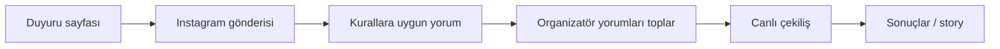
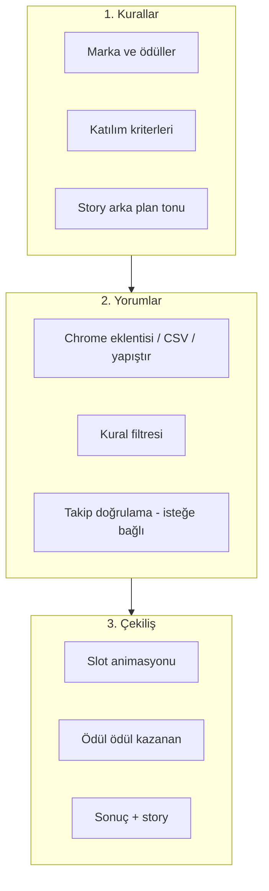
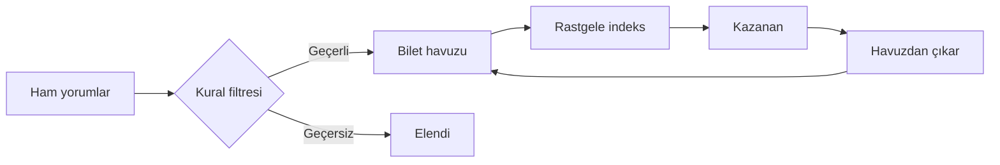

# RaffleStudio

Instagram çekilişleri için tarayıcı tabanlı, sunucusuz çekiliş stüdyosu. Yorumları toplar, kurallara göre filtreler, adil rastgele seçimle kazananları belirler ve story görselleri üretir.

**Canlı demo:** [mutfak-yazilimevi.github.io/raffle-app/](https://mutfak-yazilimevi.github.io/raffle-app/)

---

## Son kullanıcı için: Uygulama nasıl çalışır?

RaffleStudio iki yüzey sunar:

| Rol | Ne görür? |
|-----|-----------|
| **Katılımcı** | Ana sayfadaki çekiliş duyurusu, ödüller, katılım kuralları ve (çekiliş bitince) kazanan listesi |
| **Organizatör** | 3 adımlı stüdyo: Kurallar → Yorumlar → Canlı çekiliş + sonuçlar |

### Katılımcı akışı



1. **Duyuruyu okuyun** — Ana sayfada ödüller ve katılım şartları listelenir.
2. **Instagram'da katılın** — Gönderiye yorum yapın (beğeni, etiket, takip vb. organizatörün belirlediği şartlara uyun).
3. **Bekleyin** — Organizatör yorumları uygulamaya aktarır ve çekilişi başlatır.
4. **Sonuçları görün** — Kazananlar ana sayfada ve paylaşılan story görsellerinde duyurulur.

> Tüm veriler organizatörün tarayıcısında kalır. Katılımcı verisi sunucuya gönderilmez.

---

## Organizatör akışı (3 adım)



| Adım | Açıklama |
|------|----------|
| **Kurallar** | Marka, ödüller, etiket/takip/yaş vb. opsiyonel kriterler, ayar dosyası dışa aktarma |
| **Yorumlar** | Instagram yorumlarını içe aktarma, katılımcı özeti, takip şartı doğrulama (eklenti) |
| **Çekiliş** | Canlı slot makinesi, asil/yedek kazananlar, sonuç story'leri |

---

## Çekiliş ve kazanan tespit algoritması

Algoritma **bilet havuzu + uniform rastgele seçim** modeline dayanır.

### Genel şema



### Adım 1 — Yorum havuzu

Instagram yorumları şu yollarla alınır:

- Chrome eklentisi (`chrome-extension/`)
- CSV / TXT dosyası
- Panoya yapıştırma

Her kayıt: `{ username, text }`

### Adım 2 — Kural filtresi

Organizatörün tanımladığı kurallar sırayla uygulanır (hepsi opsiyonel):

| Kural | Etki |
|-------|------|
| Engelli kullanıcı | Yorum atlanır |
| Zorunlu kelime / yasaklı kelime | Metin kontrolü |
| Min / max etiket (@) | Yorum veya toplam bazında |
| Benzersiz etiket | Aynı kişiyi tekrar etiketleme engeli |
| Kişi başına max yorum | Fazla yorumlar sayılmaz |
| Takip şartı (eklenti) | Doğrulanmamış / eksik takip → elenir |

### Adım 3 — Bilet üretimi

Geçerli katılımcılar için **bilet** oluşturulur. Her bilet havuzda eşit ağırlığa sahiptir.

| Mod | Bilet sayısı |
|-----|----------------|
| Her kullanıcıya tek hak | 1 bilet / kişi |
| Her yorum bir hak | 1 bilet / geçerli yorum |
| Ağırlıklı etiket | `floor(benzersizEtiket / minEtiket)` bilet |

**Örnek:** @mehmet 3 geçerli yoruma sahipse → havuzda 3 bilet → tek seçimde kazanma olasılığı 3 kat artar.

### Adım 4 — Rastgele çekiliş

Her ödül için sırayla:

1. **Asil kazananlar** (`winnerCount` adet)
2. **Yedek kazananlar** (`substituteCount` adet)

Pseudocode:

```text
havuz = biletListesi
while ödül ve adım kaldı:
  indeks = floor(random() * havuz.length)
  kazanan = havuz[indeks]
  kaydet(kazanan)
  havuz = havuz.filter(b => b.username != kazanan.username)
```

- Seçim: `Math.floor(Math.random() * drawingPool.length)` (tarayıcı PRNG)
- Kazananın **tüm biletleri** havuzdan silinir → aynı kişi iki kez kazanamaz
- Animasyon slot makinesi yalnızca görsel; sonuç yukarıdaki seçime bağlıdır

### Adım 5 — Sonuç ve doğrulama

- Sonuçlar `localStorage`'a yazılır
- Story görselleri (duyuru, başlıyor, talihli, sonuç) canvas ile üretilir
- Kazanan kartlarında isteğe bağlı manuel doğrulama: beğeni, kaydet, hikâye, yaş, hesap türü vb.

---

## Gizlilik ve adillik

| Konu | Davranış |
|------|----------|
| **Veri** | Yorumlar, ayarlar, görseller yalnızca tarayıcıda (localStorage + IndexedDB) |
| **Sunucu** | Backend yok; veri dışarı gönderilmez |
| **Rastgelelik** | `Math.random()` — kriptografik değil; adil çekiliş için yeterli, audit gerektiren senaryolarda harici RNG düşünülebilir |
| **Şeffaflık** | Bilet sayıları yorum adımında katılımcı tablosunda görünür |

---

## Chrome eklentisi

`chrome-extension/` klasöründe Manifest V3 eklentisi:

- Instagram gönderi sayfasından yorum çekme
- Takip şartı doğrulama (profil gezerek)
- Yorumları çekiliş uygulamasına `localStorage` ile aktarma

Kurulum: `npm run zip-extension` → `public/instagram-raffle-helper.zip`

---

## Geliştirme

```bash
npm install
npm run dev      # Geliştirme sunucusu + eklenti zip
npm run build    # production build (dist/)
npm run preview  # dist önizleme
```

Stack: React 18, Vite 5, canvas-confetti, lucide-react

---

## Proje yapısı

```text
src/
  components/     UI (duyuru, kurallar, yorumlar, çekiliş, sonuçlar)
  hooks/          useRaffleForm — bilet havuzu ve form state
  utils/          Story üretimi, ayar dosyası, takip kuralları
chrome-extension/ Instagram yardımcı eklentisi
public/           Statik dosyalar + eklenti zip
```

---

## Lisans

Mutfak Yazılımevi — Instagram Çekiliş Stüdyosu
